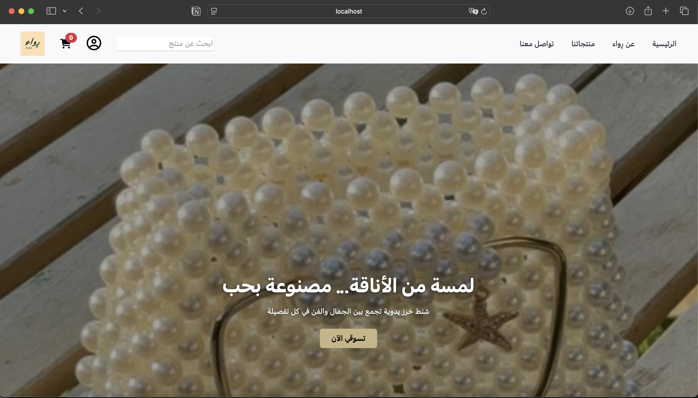

# ✨ Riwa Website

## 📌 Project Overview
Riwa is a full-stack e-commerce website for selling handmade beaded and crystal bags. The website combines an elegant, modern interface with a robust back-end system, providing a smooth shopping experience and efficient product management.

## 🎯 Project Goals
* Showcase handmade bags in a visually appealing way.
* Provide a seamless shopping experience with cart and checkout functionality.
* Enable efficient management of products and orders via a database-driven back-end.
* Ensure full integration between front-end and back-end for a scalable and maintainable system.

## 💻 Project Scope & Responsibilities

### Front-End Development
* Developed responsive pages using HTML, CSS, Bootstrap, and JavaScript.
* Designed key pages: Homepage, Products, Product Details, Cart, Checkout, Contact, Login/Register.
* Implemented navigation bar, hero section, footer, and interactive UI components.

### Back-End Development
* Built authentication system with login and registration, including input validation and password encryption.
* Integrated MySQL database for users, products, and orders.
* Implemented product search using SQL LIKE queries.
* Managed cart functionality: add/remove items, adjust quantity, and calculate totals.
* Developed checkout flow to capture user info and save orders securely.

## 🛠️ Technologies Used
* Front-end: HTML, CSS, Bootstrap, JavaScript.
* Back-end: PHP, MySQL.
* Tools: XAMPP / Local Server.

## 🖼️ Key Features
* Responsive and elegant UI.
* Dynamic product display from database (image, name, description, price, “Add to Cart” button).
* Fully functional shopping cart and checkout system.
* Secure login and registration with validation and password hashing.
* Contact page with store information and social links.

## 🚀 How It Works
1. User navigates through product pages
2. Adds products to the cart, adjusts quantities, and proceeds to checkout
3. Fills in payment and shipping information
4. Orders are saved to the database, and a success page confirms the purchase
5. Users can search for products via the search bar

## 🎥 Project Demo
Click below to view the demo video:

## 📬 Contact
If you would like to get in touch, feel free to contact me at:

📧 **Email:** arwaahalzain@email.com
